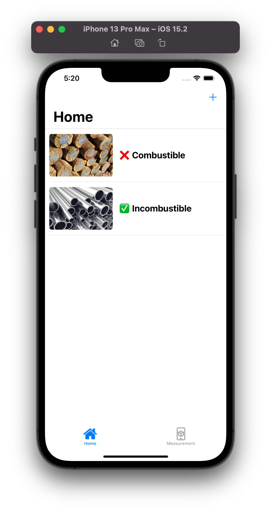

    

# Combustifier

**Put succinctly, Combustifier is a multi-platform application designed for users in HDB (Housing Development Board) blocks to easily identify combustible items in their corridors and report instances of corridors blocked by inconsiderate neighbours' property.**

I was the Team Manager as well as the iOS Developer of The Combustifier Team (that includes [@yisiansim](https://toasterclock.github.io), [@vedkalanke](https://github.com/rreserVED) and [@benjaminraharjo](https://github.com/benjaminthree)). The project consists of many components that work together in synchrony to give you accurate results in real-time.

P.S: we were thinking of project names and I was like "Hey, combustible + identifier = Combustifier" and everyone just went along with it. Credits to [@vedkalanke](https://github.com/rreserVED) for the tagline!

## The Back Story

In early July 2021, I, alongside two friends from my school ([@yisiansim](https://toasterclock.github.io) and [@vedkalanke](https://github.com/rreserVED)), were selected into the [AWS Data Science Accelerator of 2021](https://www.sgcodecampus.com/datascience-bootcamp-accelerator/) which is an intensive course meant to accelerate secondary students' skills in Python Programming and Data Science with Python.

It is a programme that was sponsored by [IMDA](https://imda.gov.sg), [AWS](https://aws.amazon.com) and Dunman Secondary School and organised by [SG Code Campus](https://sgcodecampus.com), which is a company dedicated to teaching coding to newer generations of students and providing opportunities for development.

As the end of the programme, we were tasked to make a project that would fix an issue that the [Tampines Town Council](https://tampines.org.sg) is having which is the **hoarding of common areas**. After much brainstorming and planning, we were set to make a mobile application that uses [AWS Rekognition](https://aws.amazon.com/rekognition) to identify combustible items in corridors.

## The App

The multi-platform application consists of 4 major components - the [front-end on both iOS](https://github.com/AWS-Accelerator-Group-3-2021/Combustifier) and [Android](https://github.com/AWS-Accelerator-Group-3-2021/Combustifier-Android), [The Reports System](https://github.com/AWS-Accelerator-Group-3-2021/Reports), the [Backend Server](https://github.com/AWS-Accelerator-Group-3-2021/Backend-Server) in operation with [AWS Rekognition](https://aws.amazon.com/rekognition).

### Combustifier iOS

Since I have had previous experience in iOS App Development, I took up the role of making the iOS Combustifier Application. First of all, I imagined the UI for the app to be quite simple and easy-to-use and have a tone that was similar to the rest of the operating system. So I made a plain-looking user interface with two tabs, one for Combustible *Checks* and one for Measurement (more on this later).

For the Checks tab, I wrote up a simple Table View that would show all the previous checks made by the user with the "New Check" button conveniently situated at the top-right. When you click on said button, you are immediately prompted to either take a photo or choose a photo from your photos of the potentially-combustible items. The photo is then uploaded in an encrypted manner to our Backend Server which communicates with AWS Rekognition to give a result back to the app with detected items in the image and whether it is combustible or not with a certain percentage of confidence. (more on this later) Then, the user can exit and save the check and do the whole thing again the next day!

For the Measurement tab, I had to come up with my own AR-Based measuring tool (something I had never tried before) so after a bunch of documentation hunting I was able to make my own interface to interact with the world in an augmentative fashion. With two simple clicks that show up with an orange dot, the user is able to measure the distance in between them (aka the walking space in a corridor) and has the ability to report it if it is lesser than the required clearance of 1.2m set by [the Tampines Town Council](https://tampines.org.sg).

[This is the repository link.](https://github.com/AWS-Accelerator-Group-3-2021/Combustifier)

### Combustifier Android

The android side of the app was developed entirely by [@yisiansim](https://toasterclock.github.io) (who was quite passionate about it!). He had to learn Kotlin from the ground-up with just Python being his first programming experience (what a jump, Python to Kotlin) and after much effort he was able to produce an Android version of Combustifier with Kotlin and the new JetPack Compose method of declarative UI. He also managed to integrate the new Material3 design into the application which made the app look quite amazing and, well of course, android*y*. 

The functional parts of the app are bascially a facsimilie of my application that I described above in concept. Props to him for pulling of such a marvelous feat!

[This is the repository link.](https://github.com/AWS-Accelerator-Group-3-2021/Combustifier-Android)

### The Reports System

This is a project that I worked on which was basically a web server designed to securely perform CRUD operations of reports submitted by users. This reports system is easily the most comprehensive, secure, complex, yet most easy-to-use web server I have ever designed. It consists of 3+ security layers, a comprehensive set of data transfer and notification systems and a dynamically supportive data model inception system.

The system contains two types of authentication, User and Client, which both have their unique ways of proving to the system that the incoming or outgoing source is verified and can be trusted. As for the front-end, supposedly when [the Tampines Town Council](https://tampines.org.sg) first opens up the web app, they will be prompted for their access password. Upon authorisation, a unique 24-hour-active-only authentication token will also be generated to create a secure auth session for the user to access sensitive reports data.

The report listing page is also easy to navigate with key report information being shown in every row and with each of them organised in the order of most-recently submitted to the report that was submitted the longest time ago. A convenient "Delete" button also helps the user to easily delete incorrectly submitted reports. Each report follows a specific data model that withholds key information that the council might require to contact the reporter and take action.

The above is a gross simplification of the workflow; if you wish to read a more comprehensive breakdown of the reports system API, click [here](https://github.com/AWS-Accelerator-Group-3-2021/Reports/blob/main/wiki.md).

[This is the repository link.](https://github.com/AWS-Accelerator-Group-3-2021/Reports)

### Backend Server

This is another web server that acts as a middleman between AWS Rekognition and the front-end mobile applications. It was developed by both [@yisiansim](https://toasterclock.github.io) and [@benjaminraharjo](https://github.com/benjaminthree) under guidance from [@jirehchew](https://github.com/jirehcwe), an instructor from [SG Code Campus](https://sgcodecampus.com) (who guided us all in our project in general really.). 

The Backend Server receives a [Base64](https://en.wikipedia.org/wiki/Base64) encrypted image from the mobile application. This image is first uploaded to an [AWS S3](https://aws.amazon.com/s3) bucket from where [AWS Rekognition](https://aws.amazon.com/rekognition) is signalled to query the image and process and detect the combustible items in the image based on a manually-generated list. The response is processed by the Backend Server and the combustibility of the image is detected and a certain percentage of confidence is also calculated.

This data is then returned back to the mobile application which parses and processes the data and displays it to the user in an appropriate manner.

## The Journey

> Left To Right: Prakhar Trivedi (Me), [@Ved Kalanke](https://github.com/rreserVED), [@Yisian Sim](https://toasterclock.github.io), [@Benjamin Raharjo](https://github.com/benjaminthree), [@Daniel Choo](https://github.com/dvdg6566) (one of our Teaching Assistants in the Programme)

Ever since we initiated the project in our groups in December 2021, we have learnt a lot together about the development world together. We have had several highs and lows thorughout the project but in the end we are really quite proud of how far along we came in the journey and how much we have accomplished with this project.

